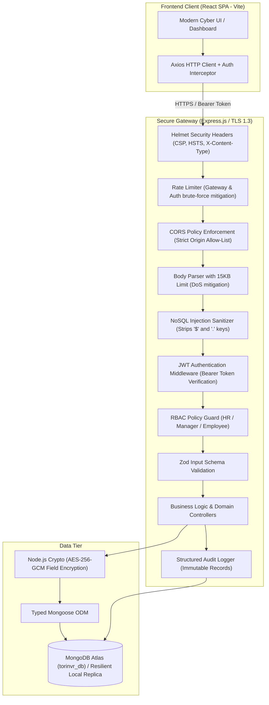
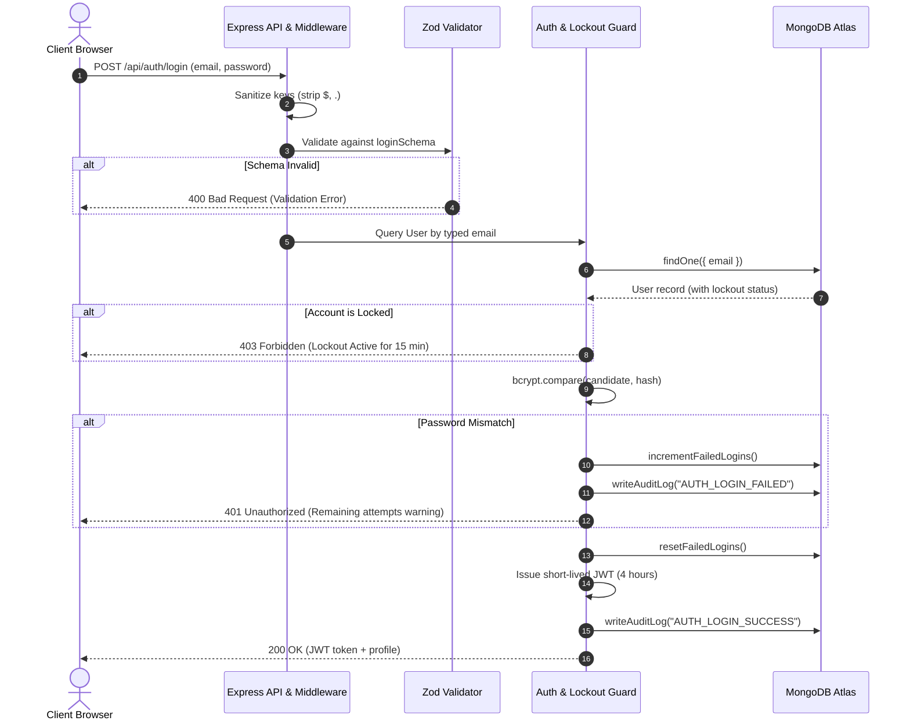
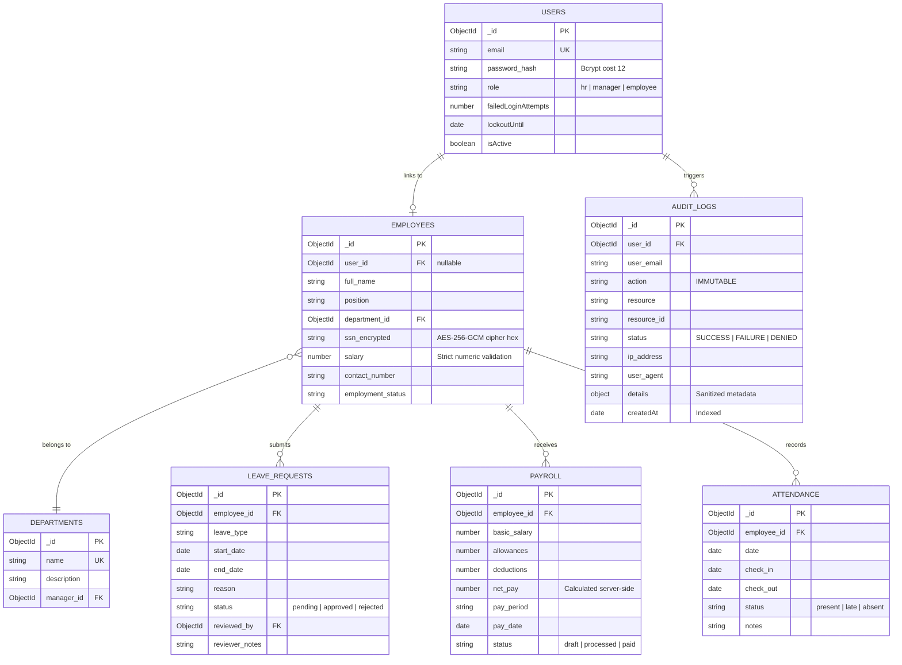

# System Architecture & Data Flow Diagrams

Course Project: Secure System Design, Risk Assessment, and Secure Implementation  
Target Stack: MERN (MongoDB Atlas · Express.js · React · Node.js)

---

## 1. High-Level System Architecture

---

## 2. Authentication & Data Flow (Defense-in-Depth)

---

## 3. Entity-Relationship Data Model

