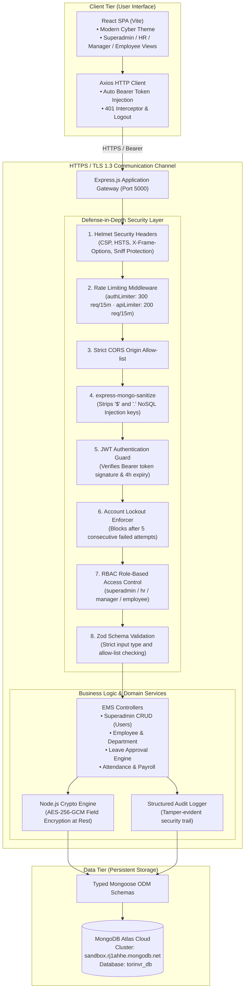
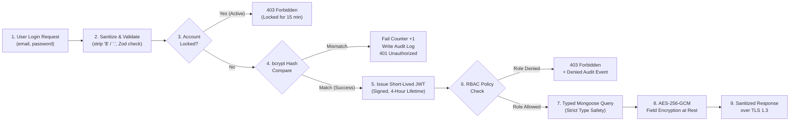
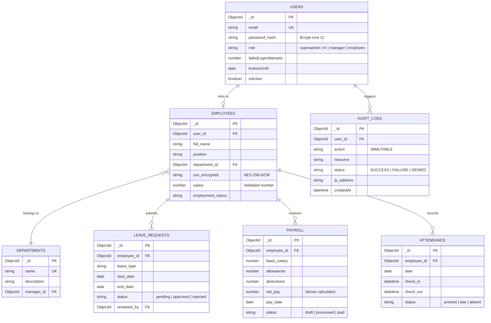

# EMS — System Architecture & Data Flow Diagrams

Course Project: **Secure System Design, Risk Assessment, and Secure Implementation**  
Target Stack: **MERN (MongoDB Atlas · Express.js · React SPA · Node.js)**  

> **How to use these diagrams:**
> - **In VS Code / Antigravity:** Use any Markdown Preview with Mermaid support.
> - **In Web / Live Preview:** Copy any Mermaid block below and paste into [mermaid.live](https://mermaid.live) or [gitdiagram.com](https://gitdiagram.com).
> - **In Draw.io:** Open [`docs/architecture_and_dfd.drawio`](file:///home/ian/Desktop/Work/INFOSEC-NEVERIO/docs/architecture_and_dfd.drawio) directly in [app.diagrams.net](https://app.diagrams.net).
> - **In Browser:** Double-click [`docs/view_diagrams.html`](file:///home/ian/Desktop/Work/INFOSEC-NEVERIO/docs/view_diagrams.html) to view visual rendered diagrams offline.

---

## 1. System Architecture Diagram (Mermaid)

---

## 2. Data Flow Diagram (DFD) — Authentication & Query Execution

---

## 3. Database Entity-Relationship (ER) Diagram

