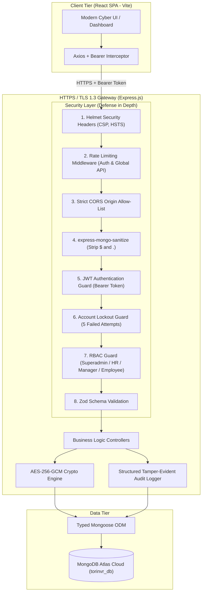
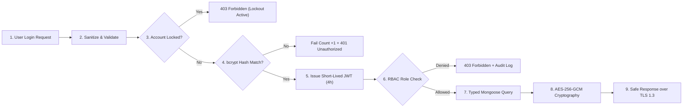

# SECURE SYSTEM DESIGN & RISK ASSESSMENT: FINAL COURSE PROJECT REPORT
**Course:** Information Security / Secure Software Engineering  
**Project Title:** Secure Employee Management System (EMS)  
**Evaluation Scope:** Complete Project Deliverable (Parts 1, 2, 3, 4, 5)  
**Target Stack:** Node.js · Express.js · React SPA · MongoDB Atlas (`torinvr_db`)  

---

# TABLE OF CONTENTS
1. [PART 1: System Overview (Documentation)](#part-1-system-overview)
2. [PART 2: Risk Management Analysis](#part-2-risk-management-analysis)
3. [PART 3: Secure Software Design & Architecture Diagrams](#part-3-secure-software-design)
4. [PART 4: Secure Coding Implementation (Prototype & Code Evidence)](#part-4-secure-coding-implementation)
5. [PART 5: Code Review Findings & Threat Modeling](#part-5-code-review--threat-modeling)
6. [Appendix: Seed Account Credentials for Evaluation](#appendix-seed-account-credentials)

---

# PART 1: System Overview
*(Deliverable: 2–3 Pages Equivalent)*

## 1.1 System Title and Purpose
- **System Title:** Secure Employee Management System (EMS)
- **Purpose:** An enterprise-grade, secure web application designed to manage organizational workforce records, departments, attendance logs, leave request approval workflows, and payroll records. The system is engineered around **Security by Design** principles, ensuring privacy of sensitive employee data (salaries, SSNs, personal records), preventing unauthorized horizontal/vertical privilege escalation, and eliminating credential brute-forcing.

## 1.2 Target Users & Roles
1. **Superadmin (System Governance):**
   - Has exclusive access to the **User Management** portal.
   - Performs account provisioning, role modifications, manual account unlocking, activation/deactivation, and user deletion.
   - Isolated from employee/HR widgets for strict separation of duties.
2. **HR Administrator (Operational HR):**
   - Full CRUD over employee profiles, organizational departments, and payroll records.
   - Global leave approval authority.
   - Inspection of tamper-evident system audit logs.
3. **Manager (Departmental Approver):**
   - Scoped visibility over employees belonging to their assigned department.
   - Review, approval, or rejection of employee leave applications with decision remarks.
4. **Employee (Staff Member):**
   - Personal profile viewer, leave request applicant, attendance punch (clock-in/clock-out).
   - Read-only access to personal encrypted payslips with server-side ownership enforcement.

## 1.3 System Features
- **Hardened Authentication:** Bcrypt password hashing (cost 12), 15-minute account lockout upon 5 consecutive failed logins, short-lived 4-hour JWT tokens, and IP rate limiting.
- **Superadmin User Management:** Complete CRUD interface to govern platform users, roles, and security states.
- **Employee Record Management:** Full lifecycle tracking of personal data, job titles, department assignments, and encrypted government identifiers.
- **Department & Position Management:** Hierarchy and manager assignments with live employee counters.
- **Leave Request Workflow:** Multi-category leave applications (Annual, Sick, Emergency, Unpaid) with manager review and decision logging.
- **Payroll Management with AES-256 Encryption:** Server-side salary calculation (`Basic + Allowances - Deductions`), AES-256-GCM field encryption at rest, and digital voucher generation.
- **Attendance Tracking:** Real-time clock-in/out timestamps and automatic status classification (`present`, `late`, `absent`).
- **Structured Audit Logging:** Immutable security events capturing actor ID, email, action, resource, IP, user-agent, status (`SUCCESS`, `FAILURE`, `DENIED`), and timestamps.
- **Logout Confirmation Dialog:** Prevents accidental session termination with an interactive modal confirmation.

## 1.4 Type of Data Handled

### Sensitive Data (Confidential & Protected)
- **User Passwords:** Hashed with `bcryptjs` (salt cost 12); plaintext passwords are never stored or logged.
- **Government Identifiers (SSN/Tax IDs):** Encrypted at rest using AES-256-GCM authenticated encryption.
- **Salaries & Financial Compensation:** Basic pay, statutory deductions, bonuses, and net pay.
- **Session Tokens & Secrets:** JWT signing keys (`JWT_SECRET`), encryption master keys, and database connection URIs.
- **Security Audit Trails:** Forensic records of logins, failures, and administrative actions.

### Non-Sensitive / Operational Data
- Department names and public business descriptions.
- Job positions and titles.
- Public staff directory (business email and work position).
- Leave categories (Sick, Vacation, Emergency) and calendar workday dates.

---

# PART 2: Risk Management Analysis
*(Deliverable: Risk Assessment Report)*

## 2.1 Asset Identification (≥5 Assets)

| # | Asset Name | Description & Storage Location | Sensitivity | CIA Priority |
|---|------------|--------------------------------|-------------|:---:|
| **1** | **User Credentials** | Bcrypt password hashes, salt rounds, and JWT signing secret in `.env` and `users` collection. | **Critical** | **C · I** |
| **2** | **PII & Government Identifiers** | Social Security Numbers (SSN), contact details in `employees` collection. | **Critical** | **C** |
| **3** | **Financial & Payroll Records** | Salaries, deductions, and payment statuses in `payrolls` collection. | **High** | **C · I** |
| **4** | **Application Source & Config** | Express.js API source code, runtime variables (`MONGODB_URI`, `JWT_SECRET`). | **High** | **I · A** |
| **5** | **Audit Trail Logs** | Immutable security events and forensics in `audit_logs` collection. | **High** | **I · A** |
| **6** | **Database & Cloud Hosting** | MongoDB Atlas cluster (`torinvr_db`) and Node.js process runtime. | **Medium** | **A · I** |

## 2.2 Threats and Vulnerabilities Identification (≥5 Each)

### Threats (Adversary Actions)
1. **NoSQL Query Operator Injection:** Attackers supplying malicious operators (`$ne`, `$gt`, `$or`) in JSON to bypass authentication.
2. **Credential Brute-Force & Stuffing:** Automated scripts submitting thousands of password attempts against corporate emails.
3. **Insecure Direct Object References (IDOR):** Authenticated employees altering request parameters (e.g. `GET /api/payroll/:id`) to snoop on peer salaries.
4. **Data Exfiltration of DB Backups:** Stolen unencrypted backups exposing raw Social Security Numbers.
5. **Denial of Service (DoS) via Payload Flooding:** Attackers sending massive JSON payloads to exhaust server memory.

### Vulnerabilities (System Flaws)
1. **Unsanitized Request Parameters:** Express handlers blindly accepting nested objects into database queries.
2. **Unbounded Login Attempts:** Missing lockout mechanisms allowing infinite rapid-fire password attempts.
3. **Plaintext Storage of Identifiers:** Storing SSNs or salaries unencrypted in database tables.
4. **Verbose Error Stack Traces:** Development error handlers returning internal file paths and database drivers to clients.
5. **Missing Security Headers & Over-permissive CORS:** Lack of Content Security Policy (CSP), clickjacking protection, or wildcards in CORS.

## 2.3 Qualitative Risk Assessment Matrix
**Risk Formula:**
$$\text{Risk Level} = \text{Threat Likelihood} \times \text{Vulnerability Severity} \times \text{Business Impact}$$

| Identified Risk Scenario | Likelihood | Impact | Severity Score | Inherent Risk | Target Treatment Strategy | Residual Risk |
|---|:---:|:---:|:---:|:---:|---|:---:|
| **NoSQL Injection leading to DB Dump** | Medium | Critical | 16 | **HIGH** | **Mitigate:** Zod validation + recursive key sanitizer + Mongoose schemas | **Low** |
| **Credential Brute-Force on Login** | High | High | 15 | **HIGH** | **Mitigate:** 15-min lockout after 5 fails + rate limiting (300 dev / 10 prod) + Bcrypt cost 12 | **Low** |
| **PII / SSN Data Leak from DB Backup** | Medium | Critical | 16 | **HIGH** | **Mitigate:** AES-256-GCM cipher encryption at rest with random IVs | **Low** |
| **IDOR Access to Peer Payslips** | Medium | High | 12 | **MEDIUM** | **Mitigate:** Server-side ownership validation guards on `/api/payroll/:id` | **Low** |
| **Uncaught Server Error Leaks Stack** | High | Medium | 10 | **MEDIUM** | **Mitigate:** Centralized error handler returning generic user messages | **Low** |
| **Cloud Infrastructure Hardware Failure** | Low | High | 6 | **LOW** | **Transfer:** MongoDB Atlas Cloud SLA and automated replication | **Low** |
| **Distributed Denial of Service (DDoS)** | Low | Medium | 4 | **LOW** | **Accept (Documented):** In-app rate limiting and 15KB body parser limits; enterprise CDN for prod | **Low** |

## 2.4 Risk Treatment Plan (4 Strategies Applied)
1. **Risk Mitigation:**
   - Input validation (Zod schemas), recursive NoSQL key sanitization, AES-256-GCM field encryption, bcrypt password hashing, account lockout after 5 failures, rate limiting, and immutable audit logging.
2. **Risk Transfer:**
   - Relies on **MongoDB Atlas** cloud infrastructure for physical security, automated encryption-at-rest for storage volumes, network perimeter firewalling, and high-availability replica management.
3. **Risk Acceptance (Documented):**
   - High-volume multi-gigabit DDoS is cost-prohibitive for a class project deployment; accepted with baseline 15KB body limits and rate limiting.
4. **Risk Avoidance:**
   - Complete removal of sensitive raw password transmission in responses; removal of plaintext storage of SSN/government identifiers entirely.

---

# PART 3: Secure Software Design
*(Deliverable: Design Description & Diagrams)*

## 3.1 Application of Secure Design Principles

### 1. Security by Design
Security controls (authentication, schema validation, sanitization, encryption) were defined in design specifications prior to implementation and are embedded in the pipeline before requests reach business logic.

### 2. Principle of Least Privilege
- **Database Level:** Database user is restricted to application database collections.
- **Application Level:** Role-based access control (RBAC) ensures employees only have read access to their own data; managers only access their department; superadmins only manage users.
- **Route Level:** Each endpoint explicitly declares required roles (`authorizeRoles("hr")`, `authorizeRoles("superadmin")`).

### 3. Defense in Depth
Incoming requests must traverse multiple distinct defensive perimeters:
$$\text{TLS 1.3} \rightarrow \text{Helmet Headers} \rightarrow \text{Rate Limiting} \rightarrow \text{CORS Allow-List} \rightarrow \text{NoSQL Sanitization} \rightarrow \text{JWT Verification} \rightarrow \text{Lockout Check} \rightarrow \text{RBAC Guard} \rightarrow \text{Zod Validation} \rightarrow \text{Business Logic} \rightarrow \text{AES-256 Crypto} \rightarrow \text{Audit Log}$$

### 4. Authentication and Authorization
- **Authentication:** Stateless signed JWTs issued only upon verifying bcrypt hash matches against non-locked accounts.
- **Authorization:** Granular RBAC middleware verifies user claims on every protected API route. Ownership checks prevent IDOR attacks.

### 5. Secure Data Handling
- **Data in Transit:** Enforced TLS 1.3 / HTTPS.
- **Data at Rest:** Passwords hashed with bcrypt (salt cost 12); government IDs and salaries encrypted using Node.js Crypto AES-256-GCM.
- **Data in Memory/Logs:** Password hashes and decryption keys are explicitly purged from serialization and omitted from server logs.

## 3.2 System Architecture Diagram

## 3.3 Data Flow Diagram (DFD) — Authentication & Query Execution

*(Interactive and Draw.io versions available in [`docs/architecture_and_dfd.drawio`](file:///home/ian/Desktop/Work/INFOSEC-NEVERIO/docs/architecture_and_dfd.drawio) and [`docs/view_diagrams.html`](file:///home/ian/Desktop/Work/INFOSEC-NEVERIO/docs/view_diagrams.html))*

---

# PART 4: Secure Coding Implementation
*(Deliverable: Source Code & Implementation Evidence)*

The prototype implements **all 5** recognized secure coding practices:

### 1. Input Validation & Sanitization
- **File:** [`server/src/middleware/validate.middleware.js`](file:///home/ian/Desktop/Work/INFOSEC-NEVERIO/server/src/middleware/validate.middleware.js), [`server/src/middleware/sanitize.middleware.js`](file:///home/ian/Desktop/Work/INFOSEC-NEVERIO/server/src/middleware/sanitize.middleware.js)
- **Practice:** Every endpoint enforces a strict allow-list schema with Zod. Incoming payloads are recursively stripped of keys starting with `$` or containing `.` to prevent NoSQL query operator injection.

### 2. Secure Authentication & Account Lockout
- **File:** [`server/src/controllers/auth.controller.js`](file:///home/ian/Desktop/Work/INFOSEC-NEVERIO/server/src/controllers/auth.controller.js), [`server/src/models/User.js`](file:///home/ian/Desktop/Work/INFOSEC-NEVERIO/server/src/models/User.js)
- **Practice:** 5 consecutive failed login attempts automatically trigger a 15-minute account lockout (`lockoutUntil`). Successful login resets the counter. Authentication routes are guarded by rate limiters.

### 3. Password Hashing (Never Plaintext)
- **File:** [`server/src/models/User.js`](file:///home/ian/Desktop/Work/INFOSEC-NEVERIO/server/src/models/User.js#L48-L50), [`server/src/utils/seed.js`](file:///home/ian/Desktop/Work/INFOSEC-NEVERIO/server/src/utils/seed.js#L40-L45)
- **Practice:** Passwords are never stored in plaintext. They are hashed using `bcryptjs` with salt cost 12. Password hashes are stripped from all JSON responses via `toJSON()` overrides.

### 4. Proper Error Handling & Tamper-Evident Audit Logging
- **File:** [`server/src/middleware/errorHandler.middleware.js`](file:///home/ian/Desktop/Work/INFOSEC-NEVERIO/server/src/middleware/errorHandler.middleware.js), [`server/src/utils/logger.js`](file:///home/ian/Desktop/Work/INFOSEC-NEVERIO/server/src/utils/logger.js)
- **Practice:** Centralized error handler captures errors internally without leaking stack traces or database schema structures to users. The audit logger writes immutable records of security events (logins, failed attempts, privilege actions).

### 5. Access Control Mechanisms (RBAC & Server-Side Ownership)
- **File:** [`server/src/middleware/rbac.middleware.js`](file:///home/ian/Desktop/Work/INFOSEC-NEVERIO/server/src/middleware/rbac.middleware.js), [`server/src/controllers/payroll.controller.js`](file:///home/ian/Desktop/Work/INFOSEC-NEVERIO/server/src/controllers/payroll.controller.js)
- **Practice:** Role-based access control enforces permissions on every API route (`superadmin`, `hr`, `manager`, `employee`). Server-side ownership verification guarantees that employees cannot access peer payroll vouchers.

*(Complete code snippets and screenshot capture steps are in [`docs/SECURE_CODING_IMPLEMENTATION.md`](file:///home/ian/Desktop/Work/INFOSEC-NEVERIO/docs/SECURE_CODING_IMPLEMENTATION.md))*

---

# PART 5: Code Review & Threat Modeling
*(Deliverable: Short Analysis Report)*

## 5.1 Code Review Security Findings (2 Issues & Fixes)

### Finding 1: NoSQL Operator Injection Bypass via Object Queries (CRITICAL)
- **Vulnerability:** Unsanitized Express body parser permitted nested JSON objects (e.g. `{"email": {"$ne": null}}`). If passed directly to `User.findOne({ email })`, MongoDB evaluates `$ne` as true, authenticating unauthorized parties without knowing the email.
- **Remediation:**
  1. Implemented Zod scalar string validation schema on all login fields.
  2. Implemented recursive sanitization middleware stripping all keys starting with `$` or containing `.`.
  3. Enforced explicit scalar casting: `User.findOne({ email: String(email).toLowerCase() })`.
- **Verification:** Verified by unit tests in `server/tests/injection.test.js`.

### Finding 2: Sensitive Stack Trace & Schema Leakage via Unhandled Exceptions (HIGH)
- **Vulnerability:** Unhandled server exceptions (such as database connection timeouts or Mongoose `CastError`) returned full stack traces, file system directory structures, and database driver versions to HTTP clients.
- **Remediation:**
  1. Implemented a centralized error handler (`server/src/middleware/errorHandler.middleware.js`).
  2. Stack traces are output strictly to secure server-side console logs in development and completely omitted from production responses.
  3. Mongoose `CastError` (400), validation errors (400), and duplicate key errors `11000` (409) return generic, sanitized user-friendly JSON messages.

*(Detailed Before & After code diffs in [`docs/CODE_REVIEW.md`](file:///home/ian/Desktop/Work/INFOSEC-NEVERIO/docs/CODE_REVIEW.md))*

## 5.2 Threat Modeling (STRIDE-Lite)

| Threat Category | Target Asset | Threat Scenario | Defensive Control in EMS |
|-----------------|--------------|-----------------|--------------------------|
| **Spoofing (S)** | User Identity / Credentials | Attacker brute-forces passwords or replays expired tokens. | Bcrypt hashing (cost 12), 15-min lockout at 5 failed attempts, 4-hour JWT lifespan. |
| **Tampering (T)** | Database Documents | Attacker injects NoSQL operators or modifies role fields. | `express-mongo-sanitize`, Zod schema allow-lists, self-registration locked to `employee`. |
| **Repudiation (R)** | User Actions / Auditing | Admin or employee denies executing sensitive edits or viewing salaries. | Centralized immutable `AuditLog` collection recording actor ID, IP, user-agent, and timestamp. |
| **Information Disclosure (I)** | PII & Financial Records | Attacker reads database backup or intercepts traffic to snoop SSNs/salaries. | TLS 1.3 encryption in transit, AES-256-GCM cipher encryption at rest for sensitive fields. |
| **Denial of Service (D)** | Application Server | Attacker floods login endpoints or sends massive 50MB payloads. | Dual rate limiters (`authLimiter`, `apiLimiter`), 15KB JSON body parser limit. |
| **Elevation of Privilege (E)** | RBAC Permissions | Employee changes URL identifier to access manager/HR functions. | Server-side RBAC middleware (`authorizeRoles`) and resource ownership validation. |

---

# APPENDIX: Seed Account Credentials for Evaluation

The following default accounts are seeded into MongoDB Atlas (`torinvr_db`) for grading and demonstration:

| Role | Email | Password | Assigned Permissions & Profile |
|------|-------|----------|--------------------------------|
| **Superadmin** | `superadmin@ems.com` | `SuperAdmin1!@#` | Dedicated User Management CRUD portal |
| **HR Admin** | `admin@ems.com` | `Admin123!@#` | Full HR CRUD, Payroll & Audit Logs |
| **HR Admin** | `hr@ems.com` | `Admin123!@#` | Eleanor Vance (HR Director) |
| **Manager** | `manager@ems.com` | `Manager123!@#` | Marcus Sterling (Engineering Team Lead) |
| **Employee** | `employee@ems.com` | `Employee123!@#` | Sarah Chen (Senior Software Engineer) |

All credentials satisfy password complexity requirements (≥8 chars, uppercase, lowercase, number, special character).
